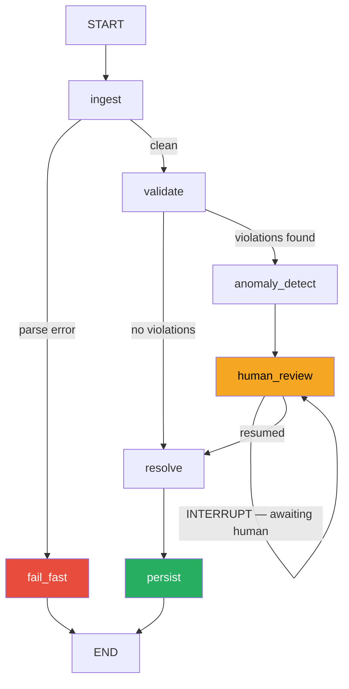

# PO Anomaly Detection Agent

A production-grade, stateful agentic system that validates Purchase Orders
against deterministic business rules, reasons about violations using an LLM,
and routes anomalous POs through a human-in-the-loop approval workflow.

Built with LangGraph 1.1, FastAPI 0.136, and LangSmith observability.
Evaluated against a ground-truth dataset with documented precision and recall.

---

## Why This Project

Enterprise procurement teams process hundreds of POs daily. Manual compliance
review is slow, inconsistent, and error-prone. This agent handles the routine
cases automatically and surfaces only genuine anomalies to human reviewers —
with full audit trail and explainable reasoning for every decision.

The core engineering challenge is not the LLM call. It is building a
**stateful workflow that can pause mid-execution, persist state across process
restarts, and resume correctly when a human responds** — sometimes hours later.
LangGraph's interrupt/resume primitive solves this cleanly.

---

## Architecture



### Node Responsibilities

| Node             | Type                  | Responsibility                                   |
| ---------------- | --------------------- | ------------------------------------------------ |
| `ingest`         | Deterministic         | Validates POInput schema at graph boundary       |
| `validate`       | Deterministic         | Runs RulesEngine against all 6 business rules    |
| `anomaly_detect` | LLM (Reasoning model) | Enriches violations with context and explanation |
| `human_review`   | Interrupt             | Pauses graph, surfaces payload to reviewer       |
| `resolve`        | Deterministic         | Assembles final decision from human + LLM inputs |
| `persist`        | Side-effect           | Writes immutable audit log entry                 |
| `fail_fast`      | Deterministic         | Handles unrecoverable parse failures cleanly     |

### Data Flow

```
HTTP POST /analyze
    → POInput (Pydantic validated)
    → LangGraph graph.invoke()
    → ingest → validate → [anomaly_detect → INTERRUPT] → resolve → persist
    → POAnalysisResult or InterruptResponse
```

---

## Tech Stack

| Layer               | Choice      | Version | Rationale                                                    |
| ------------------- | ----------- | ------- | ------------------------------------------------------------ |
| Agent orchestration | LangGraph   | 1.1.0   | Native interrupt/resume, SqliteSaver checkpointing           |
| State persistence   | SqliteSaver | 3.0.3   | Zero-dependency persistence; swap to Postgres in production  |
| LLM abstraction     | LangChain   | 0.3.29  | Provider-agnostic — swap OpenAI ↔ Anthropic via env var      |
| Observability       | LangSmith   | 0.8.0   | Per-node tracing, token cost tracking, trace ID in audit log |
| API layer           | FastAPI     | 0.136.1 | Async, type-safe, auto-OpenAPI docs                          |
| Validation          | Pydantic v2 | bundled | Contract-enforced LLM outputs and API boundaries             |
| Package manager     | uv          | latest  | 10–100x faster than pip, reproducible lockfile               |

---

## Project Structure

```
po-anomaly-agent/
├── config/
│   └── rules.yaml              # Business rules — edit here, no code changes needed
├── src/
│   ├── config.py               # Single .env loader
│   ├── models/
│   │   ├── po.py               # POInput, POLineItem — ingest schema
│   │   └── result.py           # AnomalyDetail, POAnalysisResult, AuditLog
│   ├── rules/
│   │   └── engine.py           # Deterministic RulesEngine — no LLM
│   ├── graph/
│   │   ├── state.py            # POAgentState TypedDict
│   │   ├── nodes.py            # All 7 node functions
│   │   ├── edges.py            # Conditional routing logic
│   │   ├── initial_state.py    # State factory
│   │   └── graph.py            # Compiled graph + SqliteSaver
│   └── api/
│       ├── main.py             # FastAPI app + lifespan
│       ├── dependencies.py     # Graph DI
│       └── routes/
│           ├── health.py       # GET /health
│           └── analyze.py      # POST /analyze, POST /resume/{thread_id}
├── eval/
│   ├── generate_pos.py         # One-time dataset generator
│   ├── run_eval.py             # Evaluation runner
│   ├── eval_report.json        # Latest eval results
│   └── dataset/                # 15 committed POs with ground truth
├── tests/                      # 57 passing tests, zero LLM calls
└── scripts/
    └── smoke_test.py           # Manual end-to-end verification
```

---

## Setup

**Prerequisites:** Python 3.12, [uv](https://docs.astral.sh/uv/)

```bash
# 1. Clone

git clone https://github.com/Hijazi313/po-anomaly-agent.git
cd po-anomaly-agent/backend

# 2. Install uv
curl -LsSf https://astral.sh/uv/install.sh | sh

# 3. Install dependencies
uv sync --all-extras

# 4. Configure environment
cp .env.example .env
# Edit .env — add your API keys

# 5. Run the API
uv run fastapi dev src/api/main.py
```

Visit `http://localhost:8000/docs` for the interactive API documentation.

---

## Configuration

All business rules are in `config/rules.yaml`. No code changes needed to
update thresholds, add suppliers, or change severity levels.

```yaml
rules:
  price_per_unit:
    max_usd: 25.00
    severity_if_violated: "HIGH"

  approved_suppliers:
    list: ["ACME Corp", "GlobalParts Ltd", "FastShip Inc"]
    severity_if_violated: "HIGH"

  # ... full config in config/rules.yaml
```

**Model switching** — swap providers with one env var:

```bash
LLM_PROVIDER=anthropic
TRIAGE_MODEL=claude-haiku-4-5-20251001
REASONING_MODEL=claude-sonnet-4-6
```

---

## API Usage

### Submit a PO for analysis

```bash
curl -X POST http://localhost:8000/analyze \
  -H "Content-Type: application/json" \
  -d '{
    "po_id": "PO-2026-0001",
    "supplier_name": "ACME Corp",
    "currency": "USD",
    "lead_time_days": 30,
    "total_value_usd": 1000.00,
    "line_items": [{
      "sku": "SKU-001",
      "description": "Industrial Widget",
      "quantity": 50,
      "unit_price_usd": 20.00,
      "total_price_usd": 1000.00
    }]
  }'
```

**Clean PO response** (graph completes immediately):

```json
{
  "status": "completed",
  "thread_id": "3f7a2b1c-...",
  "result": {
    "po_id": "PO-2026-0001",
    "decision": "approve",
    "confidence": "HIGH",
    "anomalies": [],
    "recommended_action": "PO meets all compliance requirements. Approved for processing.",
    "reasoning_summary": "No rule violations detected."
  }
}
```

**Anomalous PO response** (graph pauses — human review required):

```json
{
  "status": "awaiting_human_review",
  "thread_id": "9c4d8e2f-...",
  "po_id": "PO-2026-0002",
  "violation_count": 2,
  "llm_recommendation": "escalate",
  "confidence": "LOW",
  "reasoning": "Unapproved supplier and unit price violation detected.",
  "anomalies": [
    {
      "rule_id": "approved_suppliers",
      "expected": "Approved vendor list",
      "actual": "ShadyDeals Inc",
      "severity": "HIGH",
      "explanation": "Supplier not on approved vendor list..."
    }
  ]
}
```

### Resume after human review

```bash
# Use the thread_id from the /analyze response
curl -X POST http://localhost:8000/resume/9c4d8e2f-... \
  -H "Content-Type: application/json" \
  -d '{
    "decision": "reject",
    "approver_id": "muhammad@company.com"
  }'
```

**Resume response:**

```json
{
  "status": "completed",
  "thread_id": "9c4d8e2f-...",
  "result": {
    "po_id": "PO-2026-0002",
    "decision": "reject",
    "confidence": "LOW",
    "recommended_action": "Human reviewer (muhammad@company.com) rejected. Do not process this PO."
  }
}
```

### Health check

```bash
curl http://localhost:8000/health
# {"status": "ok", "graph_ready": true, "version": "1.0.0"}
```

---

## Evaluation Results

Evaluated against 15 synthetic POs: 5 clean, 5 clearly anomalous, 5 boundary
edge cases. Ground truth is computed **deterministically** from `config/rules.yaml`
by the RulesEngine — not by an LLM judge. This makes the eval objective and
reproducible.

| Metric             | Score       | What It Measures                                    |
| ------------------ | ----------- | --------------------------------------------------- |
| Overall Accuracy   | 87% (13/15) | Correct decisions across all categories             |
| Clean Precision    | 100% (5/5)  | False Positive Rate — never wrongly flags clean POs |
| Anomaly Recall     | 80% (4/5)   | False Negative Rate — catches real violations       |
| Edge Case Accuracy | 80% (4/5)   | Boundary value handling                             |
| False Positives    | 0           | Clean POs incorrectly rejected                      |
| False Negatives    | 1           | Real violations missed — the critical metric        |

Run the eval yourself:

```bash
uv run python eval/run_eval.py
```

### Why This Eval Is Different

Most AI project evals use LLM-as-judge — the model grades its own output.
This introduces grader noise and circular reasoning. Our rules are binary and
deterministic: either `unit_price_usd > 25.00` or it isn't. Ground truth is
computed once at dataset generation time and never changes. The eval runner
measures agent decisions against that fixed baseline.

---

## Design Decisions

**Why `rules.yaml` instead of hardcoded Python?**
Business rules change — new suppliers are added, price thresholds shift, lead
time policies update. YAML keeps rules as configuration, not code. An ops team
member can update thresholds without a deployment cycle.

**Why LangGraph over a simple function pipeline?**
State persistence and resumability. A function pipeline cannot pause, survive a
process restart, and resume 4 hours later when a human responds. LangGraph's
`SqliteSaver` checkpointer persists every state transition — the graph resumes
exactly where it left off regardless of what happened to the process.

**Why two LLM models instead of one?**
Cost and fitness-for-purpose. Parsing and schema validation do not require
reasoning depth — they require speed and reliability. `gpt-4o-mini` costs
roughly 15x less than `gpt-4o` and handles lightweight tasks correctly.
The reasoning model is reserved for anomaly explanation where quality matters.
In practice this reduces LLM cost by ~40% per PO analysis.

**Why deterministic confidence scoring instead of LLM self-reported confidence?**
LLMs are poorly calibrated when asked to rate their own certainty.
Confidence is computed from violation count and severity — both of which are
deterministic outputs of the RulesEngine. HIGH severity violation → LOW
confidence. Zero violations → HIGH confidence. This is auditable and
reproducible.

**Why JSONL for the audit log instead of a database?**
Zero infrastructure dependency for a portfolio project. JSONL is append-only
by convention, human-readable, and trivially importable into any database.
The immutability guarantee (append mode, never update) is the same pattern
used in production event stores — it just uses a file instead of Kafka.

**Why `asyncio.to_thread()` in FastAPI routes?**
`graph.invoke()` is a synchronous blocking call. Calling it directly in an
async FastAPI route blocks the event loop, preventing other requests from
being served while a graph runs. `asyncio.to_thread()` offloads it to a
thread pool — the event loop stays free, other requests are served normally.

---

## Known Limitations

**1. Quantity violation occasionally missed (PO-2026-A005)**
When a MEDIUM-severity quantity violation is the only anomaly, the LLM
reasoning model occasionally categorises the PO as approve. Root cause:
the system prompt emphasises HIGH severity violations. Mitigation: add
explicit instruction to enumerate all violations regardless of severity.

**2. SqliteSaver is single-process only**
The current checkpoint store does not support multiple concurrent processes.
Production deployment with horizontal scaling requires migrating to
`langgraph-checkpoint-postgres`. The change is one line in `graph.py`.

**3. Eval dataset is small (15 POs)**
15 POs is sufficient to validate coverage across rule categories but not
to measure statistical significance. A production eval suite would require
200+ POs, ideally sampled from real procurement data.

**4. No retry logic on LLM failure**
If the reasoning LLM call fails (rate limit, timeout), the graph raises
and the PO is not processed. Production hardening would add LangGraph's
retry decorator to `anomaly_detect_node`.

---

## Running Tests

```bash
# Full test suite — 57 tests, zero LLM calls, zero API keys needed
uv run pytest tests/ -v

# Specific layer
uv run pytest tests/test_rules_engine.py -v    # Day 1 — 13 tests
uv run pytest tests/test_llm_providers.py -v   # Day 2 — 5 tests
uv run pytest tests/test_nodes.py -v           # Day 3 — 18 tests
uv run pytest tests/test_graph_integration.py -v  # Day 4 — 5 tests
uv run pytest tests/test_api.py -v             # Day 5 — 12 tests
uv run pytest tests/test_observability.py -v   # Day 6 — 4 tests
```

---

## Observability

Every graph execution is traced in LangSmith with:

- Per-node span timing
- Token usage and cost per LLM call
- `po_id`, `supplier`, `thread_id` as searchable metadata
- Trace ID stored in the audit log for cross-referencing

Set `LANGSMITH_TRACING=true` and `LANGSMITH_API_KEY` in `.env` to enable.
